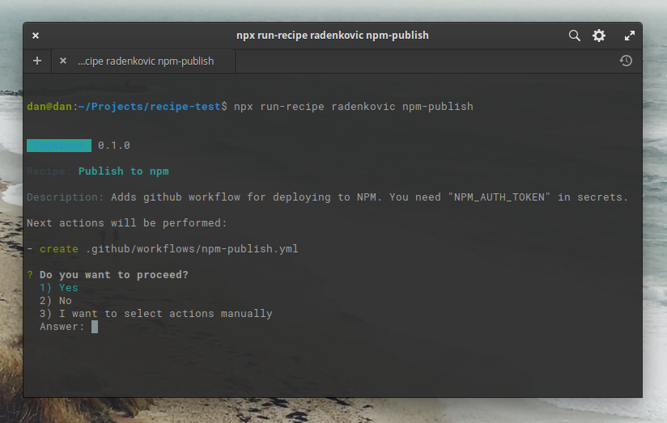

# 👨‍🍳 Cookbook

> `npx run-recipe [git repo] [path_to_recipe]`
>
> Create your cookbook for your projects. Language agnostic, configuration-oriented.



Features:

- CLI tool
- GIT based, works for public/private repos and gists
- Configuration-only (yaml files)
- Language agnostic, can be used for anything
- Supports variables

### How it works?

- when you `npx run-recipe someuser/somerepo somefolder`
- it downloads the git repo and reads `recipe.yml` from `somefolder`
- check example recipes [here](https://github.com/radenkovic/cookbook/tree/master/examples/hello)


## Getting started:

This will pull recipe from this repository (check [examples/hello](https://github.com/radenkovic/cookbook/tree/master/examples/hello) folder).

```js
  npx run-recipe radenkovic/cookbook examples/hello
  //                [ git repo ]     [ recipe ]
                 
```


## Available commands

From git:
- `npx run-recipe radenkovic react` 
  <small>(shorthand for `radenkovic/recipes react`)</small>

- `npx run-recipe git@github.com:radenkovic/recipes.git react`

- `npx run-recipe https://github.com/radenkovic/recipes.git react`

- `npx run-recipe git radenkovic/recipes react`

From local folder:
- `npx  run-recipe local ./examples/basic`

Help:
- `npx run-recipe help`

## Publish to npm

Manually bump `package.json`, then push with exact version:

```bash
git commit -m "Release 0.0.1"
```